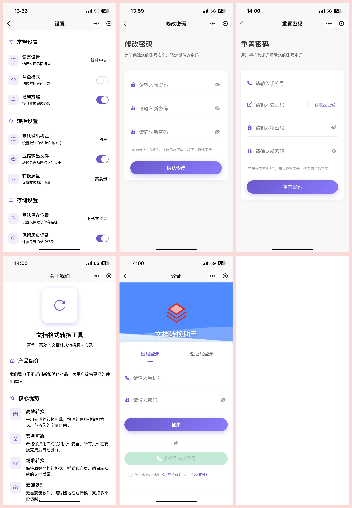

# 文档格式转换小程序

## 项目介绍

文档格式转换小程序是一款基于uni-app开发的多平台应用，旨在提供便捷、高效的文档格式转换服务。无论您是需要将PDF转换为Word、Excel转换为PDF，还是其他格式之间的互相转换，本应用都能满足您的需求。

### 主要功能

- **多格式支持**：支持PDF、Word、Excel、PPT、图片等多种格式之间的相互转换
- **批量处理**：一次性转换多个文件，提高工作效率
- **云端转换**：利用云服务进行转换，无需占用本地设备资源
- **高质量输出**：保持原文档的格式、样式和内容完整性
- **安全可靠**：文件加密传输，转换完成后自动删除，保障用户数据安全
- **跨平台使用**：支持微信小程序、H5、App等多平台使用

## 体验方式

扫描下方二维码，立即体验文档格式转换小程序：


## 系统截图




## 使用说明

1. 打开小程序，选择需要转换的文档格式类型
2. 上传需要转换的文件
3. 选择目标格式
4. 点击"开始转换"
5. 转换完成后，下载或分享转换后的文件

## 商业使用

本项目支持商业使用，如需在商业环境中部署或基于本项目进行二次开发，请遵循以下条款：

- 保留原作者版权信息
- 在产品文档中注明使用了本项目
- 不得将本项目用于非法用途

## 技术栈

- 前端框架：uni-app
- UI组件：uni-ui
- 后端服务：java、SpringBoot
- 文件转换引擎：LibreOffice、pdf2docx

## 本地开发

```bash
# 克隆项目
git clone https://github.com/cwp-cwp/document-uniapp-open.git

# 进入项目目录
cd document-uniapp-open

# 安装依赖
pnpm install

# 启动开发服务器
npm run dev:mp-weixin  # 微信小程序
# 或
npm run dev:h5  # H5版本
```

## 部署说明

```bash
# 构建生产版本
npm run build:mp-weixin  # 微信小程序
# 或
npm run build:h5  # H5版本
```

## 贡献指南

欢迎对本项目提出建议和贡献代码：

1. Fork 本仓库
2. 创建您的特性分支 (`git checkout -b feature/AmazingFeature`)
3. 提交您的更改 (`git commit -m 'Add some AmazingFeature'`)
4. 推送到分支 (`git push origin feature/AmazingFeature`)
5. 打开一个 Pull Request

## 联系方式

- 作者：B超
- 邮箱：1733459640@qq.com
- 微信：


## 许可证

本项目采用 [MIT 许可证](./LICENSE) - 详情请参阅 LICENSE 文件。

---

**注意**：使用本应用进行文档转换时，请确保您拥有相应文件的合法使用权，不要上传或转换任何侵犯他人知识产权的内容。
